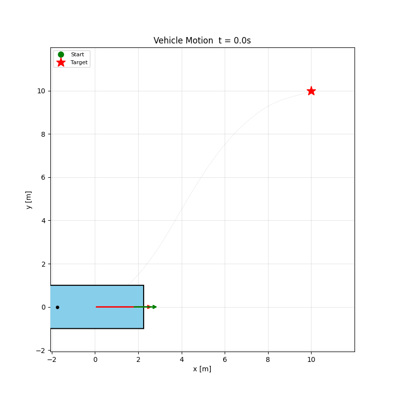
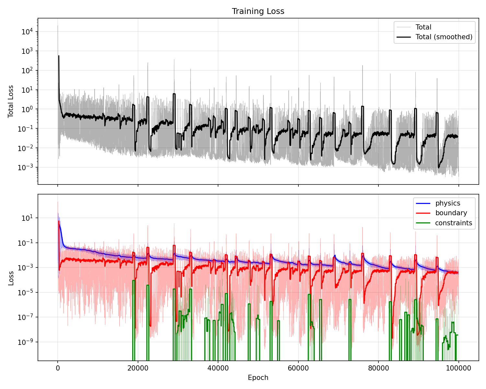

# Parking Vehicle Trajectory Planning with Physics-Informed Neural Networks

This project uses a **Physics-Informed Neural Network (PINN)** to plan a feasible trajectory for a vehicle moving from a start pose to a target parking pose, while respecting bicycle-model kinematics.

## Approach

Instead of traditional motion planning algorithms, a neural network learns to map time `t` to the full vehicle state `(x, y, theta, v, a, delta, omega, alpha)`. The network is trained by minimizing a composite loss:

- **Boundary loss** -- enforces that the trajectory starts and ends at the desired states (position, heading, velocity, steering angle, etc.).
- **Physics loss** -- enforces the bicycle kinematic model as soft constraints at randomly sampled collocation points across the time domain:
  - `dx/dt = v * cos(theta)`
  - `dy/dt = v * sin(theta)`
  - `dtheta/dt = (v / L) * tan(delta)`
  - `dv/dt = a`
  - `ddelta/dt = omega`
  - `domega/dt = alpha`
- **Constraint loss** -- penalizes extreme steering angles to keep `tan(delta)` well-behaved.

The network architecture is a simple MLP with 3 hidden layers (128 units each, Tanh activations) that takes scalar time as input and outputs all 8 state variables simultaneously.

## Results

### Training Progress

The trajectory and all state variables evolving over training epochs:


### Vehicle Motion

The final planned trajectory visualized with the vehicle body, heading arrow (red), and front-wheel steering direction (green):



### Loss History

Convergence of the total, physics, boundary, and constraint losses during training:



## Project Structure

```
src/nn/
  ParkingVehiclePINN.py   # PINN model, training loop, and visualization
  States.py               # VehicleState data class
```

## Usage

```bash
cd src/nn
python ParkingVehiclePINN.py
```

Requires PyTorch, NumPy, and Matplotlib. Automatically uses Apple MPS acceleration if available, otherwise falls back to CPU.
